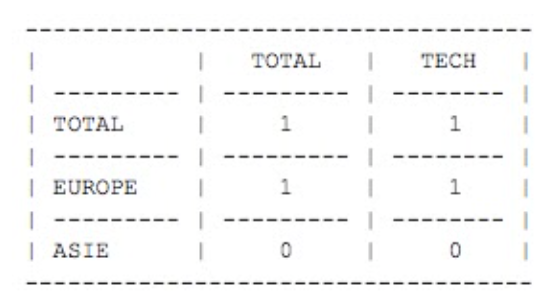

# APPENDICES

You will find enclosed to this document, 2 files: https://drive.google.com/drive/folders/1b9VnNTsnLBQrX6aScLxuFQDY1yW26SBG?usp=sharing 
- 1/ A list of a few thousands of job offers:
  ```
    profession_id,contract_type,name,office_latitude,office_longitude
    2,FULL_TIME,Dev Full Stack,48.8768868,2.3091203
  ```
- 2/ A list of “professions” (cf. “profession_id” above):
  ```
    id,name,category_name
    16,Développement Fullstack,Tech
  ```

# EXERCISES / QUESTIONS

## 01 / 03 . Exercise: Continents grouping

Using the previous data, your goal is to develop a script which will return the count of job offers per profession category per continent.

Example:



## 02 / 03 . Question: Scaling ?

Now, let’s imagine we have 100 000 000 job offers in our database, and 1000 new job offers per second (yeah, it’s a lot coming in!). What do you implement if we want the same output than in the previous exercise in real-time?

NB: no code necessary for this question

## 03 / 03 . Exercise: API implementation
						
Now, we would like those data to become usable! The goal of this exercise is to develop an API with a single endpoint which will allow to get the previous job offers around a given location (through coordinates) and a given radius around this location (eg: 50km).

Query parameters for this endpoint:
* latitude (eg: 48.8659387)
* longitude (eg: 2.34532)
* radius (eg: 10 (km))

In the output, we want the list of job offers corresponding to the previous search criteria.
Also, if you’re able to mention the proximity of the job offers to the defined coordinates, it would be obviously a plus!